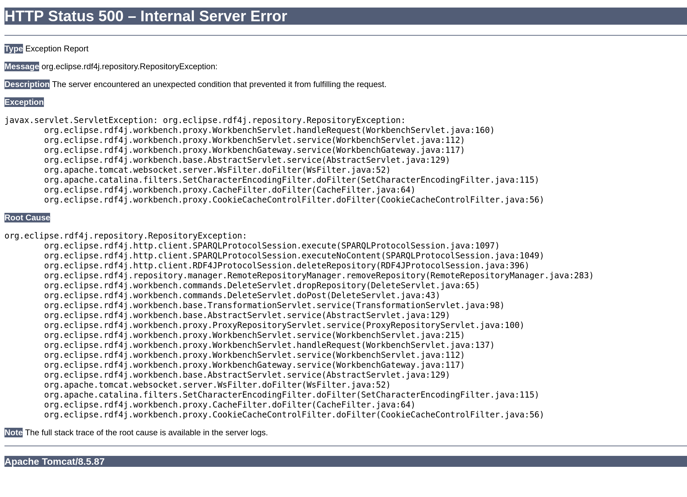

# RDF4J Auto Grow Issue

## Description
This repository contains a 'minimal' example to reproduce the auto grow issue in RDF4J.
## Steps to reproduce
1. Clone this repository
2. Get the offical RDF4J docker image 4.2.3 up and running:
   - `[docker/podman] run -dt -p 8080:8080 -e JAVA_OPTS="-Xms2g -Xmx16g" -v data:/var/rdf4j -v logs:/usr/local/tomcat/logs eclipse/rdf4j-workbench:4.2.3`
3. Build and execute the project with Gradle:
   - `./gradlew run`

If the port 8080 is already in use, please adapt the command above and Line 18 in https://github.com/Philipp-p/RDF4J.auto.grow.issue/blob/1c86f3354b6240a07cb6ac704cdc06304d6faa71/src/main/java/demo/Application.java#L18.

## Expected behavior
The Application should convert a rather large IFC file to and RDF model and commit it to the RDF4J repository. Afterwards that the context wil be deleted and the same model will be added to the repository. This should work without any issues.

## Actual behavior
The Application will convert a rather large IFC file and add it to the repository. Afterwards the context will be deleted and the same model added again to the repository. This will fail during the commit of the second transaction with the following error message:
```java
 WARN [main] (SPARQLProtocolSession.java:1228) - Server reports problem: null (enable debug logging for full details)
        org.eclipse.rdf4j.repository.RepositoryException: Transaction handling error: org.eclipse.rdf4j.repository.RepositoryException: org.eclipse.rdf4j.sail.SailException: java.io.IOException: MDB_MAP_FULL: Environment mapsize limit reached
        at org.eclipse.rdf4j.http.client.SPARQLProtocolSession.execute(SPARQLProtocolSession.java:1095)
        at org.eclipse.rdf4j.http.client.RDF4JProtocolSession.commitTransaction(RDF4JProtocolSession.java:732)
        at org.eclipse.rdf4j.repository.http.HTTPRepositoryConnection.commit(HTTPRepositoryConnection.java:327)
        at demo.Application.main(Application.java:74)
        WARN [main] (HTTPRepositoryConnection.java:359) - Rolling back transaction due to connection close
        java.lang.Throwable
        at org.eclipse.rdf4j.repository.http.HTTPRepositoryConnection.close(HTTPRepositoryConnection.java:359)
        at demo.Application.main(Application.java:82)
        Exception in thread "main" java.lang.RuntimeException: org.eclipse.rdf4j.repository.RepositoryException: Transaction handling error: org.eclipse.rdf4j.repository.RepositoryException: org.eclipse.rdf4j.sail.SailException: java.io.IOException: MDB_MAP_FULL: Environment mapsize limit reached
        at demo.Application.main(Application.java:84)
        Caused by: org.eclipse.rdf4j.repository.RepositoryException: Transaction handling error: org.eclipse.rdf4j.repository.RepositoryException: org.eclipse.rdf4j.sail.SailException: java.io.IOException: MDB_MAP_FULL: Environment mapsize limit reached
        at org.eclipse.rdf4j.http.client.SPARQLProtocolSession.execute(SPARQLProtocolSession.java:1095)
        at org.eclipse.rdf4j.http.client.RDF4JProtocolSession.commitTransaction(RDF4JProtocolSession.java:732)
        Caused by: org.eclipse.rdf4j.repository.RepositoryException: Transaction handling error: org.eclipse.rdf4j.repository.RepositoryException: org.eclipse.rdf4j.sail.SailException: java.io.IOException: MDB_MAP_FULL: Environment mapsize limit reached

        at org.eclipse.rdf4j.repository.http.HTTPRepositoryConnection.commit(HTTPRepositoryConnection.java:327)
        at demo.Application.main(Application.java:74)
```

The container still runs after this error and the workbench is accessible, but the repository just created is in an inconsistent state. If your try for example to delete the repository, the workbench will throw an error:



This happens on a PC with 32GB of RAM and an AMD Ryzen 7 5800X running Pop!_OS 22.04 very time and also on a similar Debian 11 server.

On an 2018 MacBook Pro with 32GB of RAM and an Intel Core I7-8750H the first transaction already fails during the commit with the following error message:
```java
WARN [rdf4j-pingScheduler] (SharedHttpClientSessionManager.java:102) - Closing stale connection
 WARN [main] (SharedHttpClientSessionManager.java:102) - Closing stale connection
org.apache.http.client.ClientProtocolException
        at org.apache.http.impl.client.InternalHttpClient.doExecute(InternalHttpClient.java:187)
        at org.apache.http.impl.client.CloseableHttpClient.execute(CloseableHttpClient.java:83)
        at org.apache.http.impl.client.CloseableHttpClient.execute(CloseableHttpClient.java:56)
        at org.eclipse.rdf4j.http.client.SPARQLProtocolSession.execute(SPARQLProtocolSession.java:1065)
        at org.eclipse.rdf4j.http.client.SPARQLProtocolSession.executeNoContent(SPARQLProtocolSession.java:1049)
        at org.eclipse.rdf4j.http.client.RDF4JProtocolSession.upload(RDF4JProtocolSession.java:1101)
        at org.eclipse.rdf4j.http.client.RDF4JProtocolSession.upload(RDF4JProtocolSession.java:926)
        at org.eclipse.rdf4j.http.client.RDF4JProtocolSession.upload(RDF4JProtocolSession.java:917)
        at org.eclipse.rdf4j.repository.http.HTTPRepositoryConnection.add(HTTPRepositoryConnection.java:447)
        at org.eclipse.rdf4j.repository.RepositoryConnection.add(RepositoryConnection.java:696)
        at demo.Application.main(Application.java:56)
Caused by: org.apache.http.client.NonRepeatableRequestException: Cannot retry request with a non-repeatable request entity
        at org.apache.http.impl.execchain.RetryExec.execute(RetryExec.java:108)
        at org.apache.http.impl.execchain.ServiceUnavailableRetryExec.execute(ServiceUnavailableRetryExec.java:85)
        at org.apache.http.impl.execchain.RedirectExec.execute(RedirectExec.java:110)
        at org.apache.http.impl.client.InternalHttpClient.doExecute(InternalHttpClient.java:185)
        ... 10 more
Caused by: java.net.SocketException: Broken pipe
        at java.base/sun.nio.ch.NioSocketImpl.implWrite(NioSocketImpl.java:417)
        at java.base/sun.nio.ch.NioSocketImpl.write(NioSocketImpl.java:437)
        at java.base/sun.nio.ch.NioSocketImpl$2.write(NioSocketImpl.java:823)
        at java.base/java.net.Socket$SocketOutputStream.write(Socket.java:1035)
        at org.apache.http.impl.io.SessionOutputBufferImpl.streamWrite(SessionOutputBufferImpl.java:124)
        at org.apache.http.impl.io.SessionOutputBufferImpl.flushBuffer(SessionOutputBufferImpl.java:136)
        at org.apache.http.impl.io.SessionOutputBufferImpl.write(SessionOutputBufferImpl.java:167)
        at org.apache.http.impl.io.ChunkedOutputStream.flushCacheWithAppend(ChunkedOutputStream.java:122)
        at org.apache.http.impl.io.ChunkedOutputStream.write(ChunkedOutputStream.java:179)
        at org.apache.http.entity.InputStreamEntity.writeTo(InputStreamEntity.java:134)
        at org.apache.http.impl.execchain.RequestEntityProxy.writeTo(RequestEntityProxy.java:121)
        at org.apache.http.impl.DefaultBHttpClientConnection.sendRequestEntity(DefaultBHttpClientConnection.java:156)
        at org.apache.http.impl.conn.CPoolProxy.sendRequestEntity(CPoolProxy.java:152)
        at org.apache.http.protocol.HttpRequestExecutor.doSendRequest(HttpRequestExecutor.java:238)
        at org.apache.http.protocol.HttpRequestExecutor.execute(HttpRequestExecutor.java:123)
        at org.apache.http.impl.execchain.MainClientExec.execute(MainClientExec.java:272)
        at org.apache.http.impl.execchain.ProtocolExec.execute(ProtocolExec.java:186)
        at org.apache.http.impl.execchain.RetryExec.execute(RetryExec.java:89)
        ... 13 more
 WARN [main] (HTTPRepositoryConnection.java:359) - Rolling back transaction due to connection close
java.lang.Throwable
        at org.eclipse.rdf4j.repository.http.HTTPRepositoryConnection.close(HTTPRepositoryConnection.java:359)
        at demo.Application.main(Application.java:82)
 WARN [main] (SharedHttpClientSessionManager.java:102) - Closing stale connection
 WARN [rdf4j-pingScheduler] (RDF4JProtocolSession.java:822) - Failed to ping transaction
Exception in thread "main" org.eclipse.rdf4j.repository.RepositoryException: java.net.SocketException: Connection reset
        at org.eclipse.rdf4j.repository.http.HTTPRepositoryConnection.rollback(HTTPRepositoryConnection.java:351)
        at org.eclipse.rdf4j.repository.http.HTTPRepositoryConnection.close(HTTPRepositoryConnection.java:360)
        at demo.Application.main(Application.java:82)
Caused by: java.net.SocketException: Connection reset
        at java.base/sun.nio.ch.NioSocketImpl.implRead(NioSocketImpl.java:320)
        at java.base/sun.nio.ch.NioSocketImpl.read(NioSocketImpl.java:347)
        at java.base/sun.nio.ch.NioSocketImpl$1.read(NioSocketImpl.java:800)
        at java.base/java.net.Socket$SocketInputStream.read(Socket.java:966)
        at org.apache.http.impl.io.SessionInputBufferImpl.streamRead(SessionInputBufferImpl.java:137)
        at org.apache.http.impl.io.SessionInputBufferImpl.fillBuffer(SessionInputBufferImpl.java:153)
        at org.apache.http.impl.io.SessionInputBufferImpl.readLine(SessionInputBufferImpl.java:280)
        at org.apache.http.impl.conn.DefaultHttpResponseParser.parseHead(DefaultHttpResponseParser.java:138)
        at org.apache.http.impl.conn.DefaultHttpResponseParser.parseHead(DefaultHttpResponseParser.java:56)
        at org.apache.http.impl.io.AbstractMessageParser.parse(AbstractMessageParser.java:259)
        at org.apache.http.impl.DefaultBHttpClientConnection.receiveResponseHeader(DefaultBHttpClientConnection.java:163)
        at org.apache.http.impl.conn.CPoolProxy.receiveResponseHeader(CPoolProxy.java:157)
        at org.apache.http.protocol.HttpRequestExecutor.doReceiveResponse(HttpRequestExecutor.java:273)
        at org.apache.http.protocol.HttpRequestExecutor.execute(HttpRequestExecutor.java:125)
        at org.apache.http.impl.execchain.MainClientExec.execute(MainClientExec.java:272)
        at org.apache.http.impl.execchain.ProtocolExec.execute(ProtocolExec.java:186)
        at org.apache.http.impl.execchain.RetryExec.execute(RetryExec.java:89)
        at org.apache.http.impl.execchain.ServiceUnavailableRetryExec.execute(ServiceUnavailableRetryExec.java:85)
        at org.apache.http.impl.execchain.RedirectExec.execute(RedirectExec.java:110)
        at org.apache.http.impl.client.InternalHttpClient.doExecute(InternalHttpClient.java:185)
        at org.apache.http.impl.client.CloseableHttpClient.execute(CloseableHttpClient.java:83)
        at org.apache.http.impl.client.CloseableHttpClient.execute(CloseableHttpClient.java:56)
        at org.eclipse.rdf4j.http.client.SPARQLProtocolSession.execute(SPARQLProtocolSession.java:1065)
        at org.eclipse.rdf4j.http.client.RDF4JProtocolSession.rollbackTransaction(RDF4JProtocolSession.java:768)
        at org.eclipse.rdf4j.repository.http.HTTPRepositoryConnection.rollback(HTTPRepositoryConnection.java:346)
        ... 2 more
```
Furthermore, the container crashes in this case with nothing usefully in the logs since it simply stops after ```Server startup in X ms``` message.

## "Fixing" the issue
This issue does not occur when the line https://github.com/Philipp-p/RDF4J.auto.grow.issue/blob/1c86f3354b6240a07cb6ac704cdc06304d6faa71/src/main/java/utils/RepositoryUtils.java#L52 and following are not commented out. They increase the initial size of the DB. This and the exception thrown in the first case, hints that the issue might be linked to the auto grow function. 
However, it is rather puzzling why the same code exhibits a different behaviour on a laptop than on a PC/server.

## Proof of concept for the code in general
The code runs also without any issues when instead of the large IFC files the smaller one ```BasicWall.ifc``` is used.
